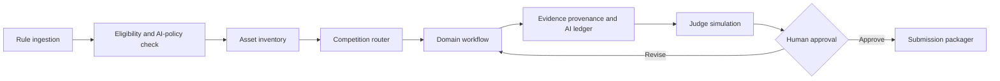

# Competition Workflow Orchestration

## Orchestrator rules

1. Rules and eligibility are blocking prerequisites.
2. Planning nodes may run with partial inputs; execution nodes may not cross budget or privacy gates.
3. Domain skills may run in parallel only when they do not write the same artifact.
4. Claims cannot enter a deck or paper until evidence-provenance marks them supported or explicitly provisional.
5. Judge simulation cannot create evidence; it only evaluates available evidence.
6. Submission packaging is a read-only preflight until final human approval.
7. Web research runs through `WebResearchGateway`; official sources outrank community sources.
8. Authenticated browser/CLI access returns normalized evidence and never exposes credentials to skills.
9. Every skill starts in zero-config mode and degrades individual operations, not the whole skill.
10. Human-output rendering runs after evidence checks and cannot alter facts, provenance, or AI disclosure.

## Recommended modes

| Mode | Typical use | Orchestration |
|---|---|---|
| Sprint | 24-72 hour modeling/programming contest | strict critical path, frequent checkpoints |
| Project | multi-week innovation/engineering contest | hypothesis and evidence backlog |
| Research | challenge cup academic work/research competition | ethics, methods, experiment and paper gates |
| Live | programming/robotics/on-site contest | tool restrictions and offline fallback |
| Defense | pitch, demo and Q&A | rubric-driven rehearsal and version freeze |

## Risk gates

| Gate | Trigger | Required approver |
|---|---|---|
| Rule interpretation | conflict, missing current rules | team lead/teacher |
| Human subjects | interviews, surveys, minors, health data | teacher/ethics owner |
| Cost | paid API, cloud GPU, procurement | budget owner |
| External contact | email, recruitment, outreach, publication | team lead |
| Claims | patent, revenue, partnership, deployment, measured impact | evidence owner |
| Submission | upload, final package, declaration | team lead |